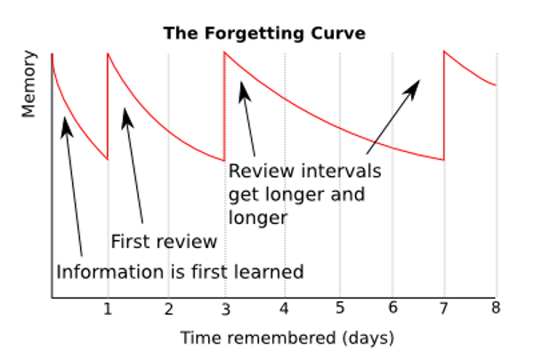
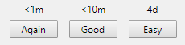

# OWASP Application Security Verification Standard Anki Deck

## Summary

Application security is increasingly important as software proliferates throughout our world. However, designing and implementing an application securely is no easy task. The purpose of this project is to improve the user's knowledge of application security using an evidenced-based learning technique known as spaced repetition. 

This particular project uses the OWASP Application Security Verification Standard (ASVS) for its content. This comprehensive and language agnostic security standard serves as a useful overview of application security. Find out more about ASVS at https://github.com/OWASP/ASVS

The content is packaged in the form of Anki deck. Anki is free and open source spaced repetition software (SRS). Find out more about Anki at https://apps.ankiweb.net/

## Audience

Who can benefit from this using this resource?
* Software Engineers 
* Application Security Engineers
* Trainers/Instructors
* Students
* Anybody else interested in application security

## What is spaced repetition and why should it be used?

The problem with most application security training is the lack of reinforcement after the information is initially learned. This lack of reinforcement leads to difficulty in recalling information learned during the training, even if the training was completed relatively recently.

Most organizations have a single annual training, which predictably results in poor retention. Thus, the organization's security posture is not significantly improved. In order to really make things "stick", one must periodically review the information. 

However, introducing periodic reviews requires certain decisions and tradeoffs. What material should be reviewed? How often should it be reviewed? Given the large amount of information involved and the limited amount of time and energy that can be invested in training, it is critical that periodic review be optimized.

>Spaced repetition is an evidence-based learning technique that is usually performed with flashcards. Newly introduced and more difficult flashcards are shown more frequently while older and less difficult flashcards are shown less frequently in order to exploit the psychological spacing effect. The use of spaced repetition has been proven to increase rate of learning. (https://en.wikipedia.org/wiki/Spaced_repetition)

## How does Anki aid spaced repetition?

Anki is useful because it simplifies and organizes the spaced repetition system, allowing the user to focus all of their efforts on the training material itself. First the user imports the deck of flashcards that they would like to review. Then, they begin reviewing a few cards per study session (default setting is 20 cards per session, this can easily be adjusted). Once each card is reviewed, the user marks how difficult the card was.

Based on user feedback, Anki determines the proper interval for future review. As a user becomes more familiar with a topic, that topic becomes reviewed less and less often. The more feedback Anki receives, the more optimized the review process becomes.

As a bonus, Anki comes in both PC and mobile versions. Having Anki on a mobile device allows one to quickly review a few flashcards during downtime while away from the PC.

Anki provides numerous ways of tweaking the review process. To learn more, watch the video below:

## Installation

1. Download Anki from https://apps.ankiweb.net/#download and follow the installation instructions
2. Download the Anki deck from this repository
3. Import the Anki deck into Anki by double clicking on it or clicking on File --> Import

## License

The entire project content is under the **[Creative Commons v3.0](https://creativecommons.org/licenses/by-sa/3.0/)** license.

The original licensor (OWASP) does not endorse author or the author's use.